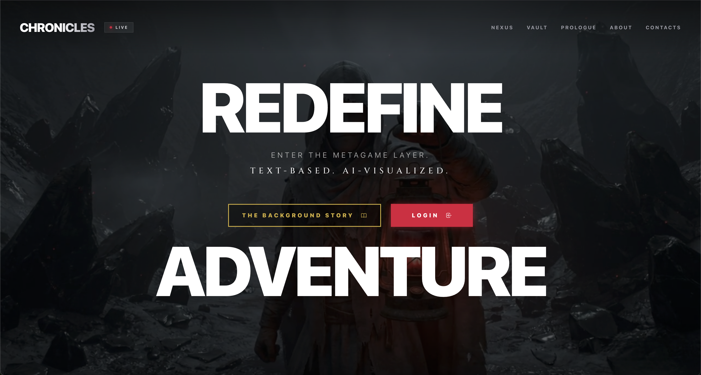
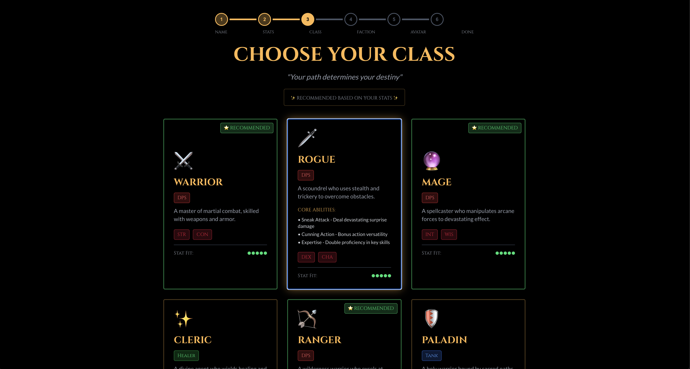
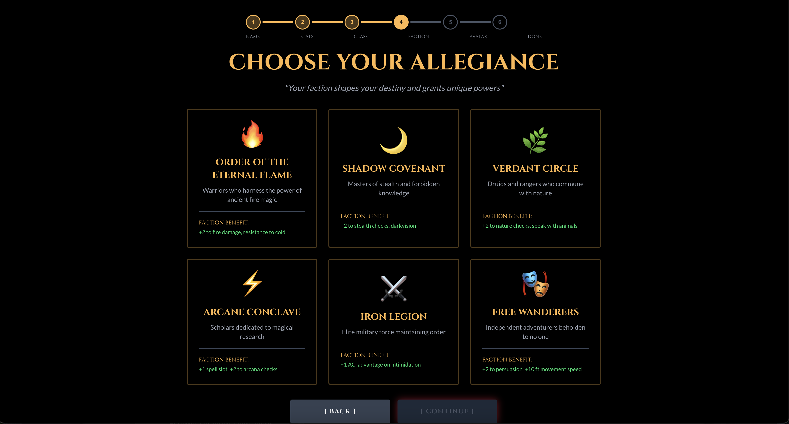

# Aether Chronicles

Aether Chronicles is an AI-powered text-based Roleplaying Game (RPG) built with Next.js, Supabase, Mistral AI, and multi-provider image generation (Bytez, Pollinations, Cloudflare Workers AI). Set in a dark fantasy world with amber-lit mystical themes, the game serves as an infinite digital Dungeon Master, allowing your imagination to be the only limit.

## Screenshots

| | | |
|:---:|:---:|:---:|
|  |  |  |
|  |  |  |


## Features

- **Infinite Digital Dungeon Master**: Powered by Mistral AI, the game dynamically responds to your actions, narrates the story, describes the environment, and manages skill checks based on classic Dungeons & Dragons mechanics.
- **Dynamic AI Imagery**: Uses Bytez, Pollinations, and Cloudflare Workers AI with configurable fallback order for scene and portrait generation.
- **Cloud Image Hosting (Optional)**: If Cloudinary keys are provided, generated images are uploaded and stored as permanent `https://` URLs.
- **Environmental Animations**: The UI reacts to the story with dynamic weather and atmospheric effects, such as flickering lights, rain, snow, fog, embers, and lightning.
- **Deep Character Customization**: Create your hero with customizable classes, allegiances, and classic RPG ability scores (Strength, Dexterity, Constitution, Intelligence, Wisdom, Charisma).
- **Secure Authentication & Cloud Saves**: Seamlessly powered by Supabase, your characters and progression are securely stored in the cloud.

## Tech Stack

- **Frontend**: Next.js 16 (App Router), React 19, Tailwind CSS v4
- **Backend**: FastAPI (Python)
- **Database & Auth**: Supabase (PostgreSQL with Row Level Security)
- **AI Integration**: Mistral AI (Narrator/DM), Bytez/Pollinations/Cloudflare (Image Generation), Cloudinary (Optional Hosting)

## Getting Started

### Prerequisites

- Node.js (v20.9.0 or higher)
- Python 3.8+
- [Supabase](https://supabase.com/) Account & Project
- [Mistral AI](https://mistral.ai/) API Key
- [Bytez](https://bytez.com/) API Key (optional if using Bytez provider)
- [Pollinations.ai](https://pollinations.ai/) (no key required by default)
- [Cloudflare](https://dash.cloudflare.com/) Account + API Token (Workers AI)
- [Cloudinary](https://cloudinary.com/) Account (optional, for hosted image URLs)

### Installation

1. **Clone the repository:**
   ```bash
   git clone https://github.com/stevie1mat/joel-ai.git
   cd joel-ai
   ```

2. **Setup Frontend:**
   ```bash
   npm install
   ```

3. **Setup Environment Variables:**
   Copy the example environment file:
   ```bash
   cp .env.example .env.local
   ```
   Fill in your API keys in `.env.local`:
   ```env
   NEXT_PUBLIC_SUPABASE_URL=your_supabase_url
   NEXT_PUBLIC_SUPABASE_ANON_KEY=your_supabase_anon_key
   MISTRAL_API_KEY=your_mistral_api_key
   IMAGE_PROVIDER_ORDER=bytez,pollinations,cloudflare
   BYTEZ_API_KEY=your_bytez_api_key
   BYTEZ_IMAGE_MODEL=stabilityai/stable-diffusion-xl-base-1.0
   CLOUDFLARE_ACCOUNT_ID=your_cloudflare_account_id
   CLOUDFLARE_API_TOKEN=your_cloudflare_api_token
   CLOUDFLARE_IMAGE_MODEL=@cf/stabilityai/stable-diffusion-xl-base-1.0
   POLLINATIONS_ENABLED=true
   POLLINATIONS_MODEL=flux
   POLLINATIONS_BASE_URL=https://image.pollinations.ai/prompt
   POLLINATIONS_API_KEY=your_pollinations_api_key
   CLOUDINARY_CLOUD_NAME=your_cloudinary_cloud_name
   CLOUDINARY_API_KEY=your_cloudinary_api_key
   CLOUDINARY_API_SECRET=your_cloudinary_api_secret
   CLOUDINARY_PORTRAITS_FOLDER=aether-chronicles/portraits
   CLOUDINARY_SCENES_FOLDER=aether-chronicles/scenes
   ```

4. **Setup Database:**
   Run the SQL statements found in `supabase-schema.sql` in your Supabase project's SQL Editor to create the necessary tables and RLS policies for character management.

5. **Setup Python Backend:**
   Navigate to the backend directory, install requirements (easiest with a virtual environment), and run the server:
   ```bash
   cd backend
   pip install fastapi pydantic python-dotenv mistralai uvicorn
   uvicorn main:app --reload --port 8000
   ```
   *(Ensure your `.env.local` is present in the root directory as the backend will load it from there).*

6. **Start the Frontend Development Server:**
   In a new terminal, run:
   ```bash
   npm run dev
   ```

7. **Play!**
   Open [http://localhost:3000](http://localhost:3000) with your browser to start your adventure.

## License

This project is private and intended for personal use.
